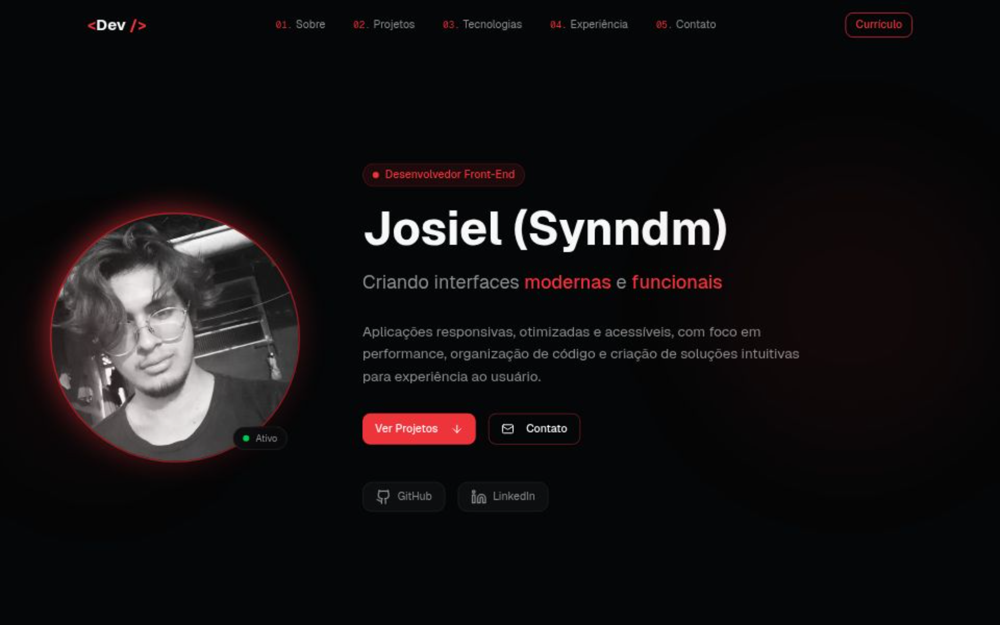

# 🚀 Meu Portfólio

Portfólio pessoal desenvolvido para apresentar meus projetos, habilidades e experiências com foco em desenvolvimento de interfaces modernas, responsivas e acessíveis.

## ✨ Preview



---

## 🛠 Tecnologias Utilizadas

* Next.js
* React
* TypeScript
* Tailwind CSS
* shadcn/ui
* Lucide React
* Vercel Analytics

---

## 🎯 Objetivo

Criar uma aplicação moderna e performática para centralizar meus projetos, destacar minhas habilidades e proporcionar uma experiência visual agradável e intuitiva.

---

## ⚙️ Funcionalidades

* Layout responsivo
* Tema dark moderno
* Animações suaves
* Seção de projetos destacados
* Links para GitHub e demonstrações
* Interface otimizada para diferentes dispositivos

---

## 📁 Estrutura do Projeto

```bash
src/
 ├── app/
 ├── components/
 ├── lib/
 └── styles/
```

---

## 🚀 Como Executar o Projeto

Clone o repositório:

```bash
git clone https://github.com/Synndm/meuPortifolio.git
```

Acesse a pasta:

```bash
cd meuPortifolio
```

Instale as dependências:

```bash
npm install
```

Execute o projeto:

```bash
npm run dev
```

---

## 🌐 Deploy

O projeto pode ser publicado facilmente utilizando:

* Vercel
* Netlify
* GitHub Pages

---

## 📬 Contato

* GitHub: https://github.com/Synndm
* LinkedIn: Adicione seu LinkedIn aqui

---

## 📄 Licença

Este projeto está sob a licença MIT.
